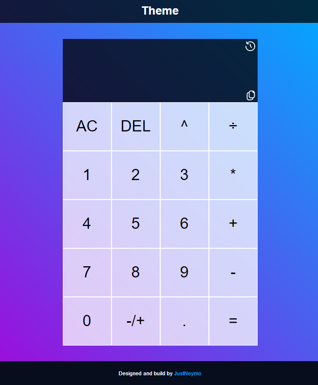

# [Calculator](https://pubec929.github.io/Calculator/)

A basic calculator build with vanilla JavaScript

## Preview

## How to install and set up

    git clone <your-forked-repo>
    npm install
    npm run dev
